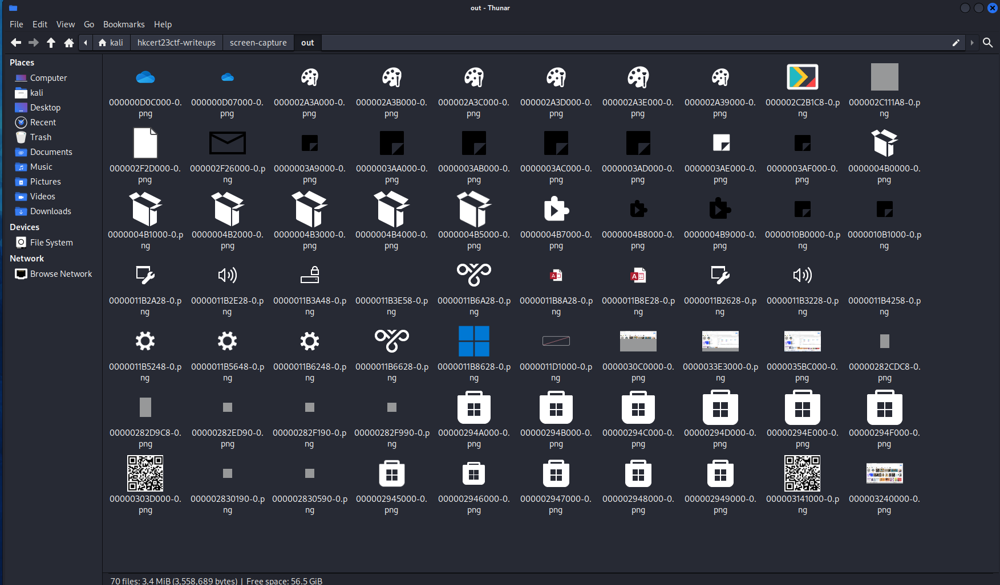
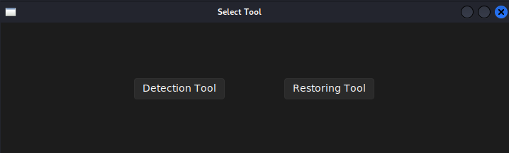
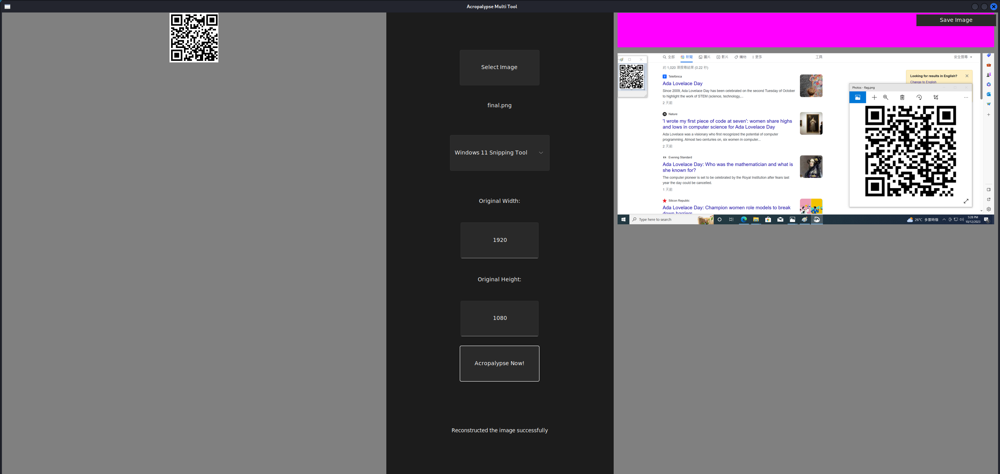

mount the vmdk image

```bash
sudo losetup /dev/loop30 "Windows 11 x64-000003.vmdk"
```

recover all png files in the image

```bash
mkdir out
sudo magicrescue -r png -d ./out /dev/loop30
```



we can see our qrcode is lying right here.... <br/>
and we get rickrolled 🥺


according to the hints given, we have to extract the cropped part of the image by a vunerability called `aCropalypse`

since `magicrescue` crops the trail part of the image, we have to recover the whole image file first

from the filename of `00000303D000-0.png`, we know that the offset is `50581504`

from the challenge description, we know that the filesize is `383kb` <br/>
but i'm lazy, i just assume it as `512kb`, which is `512*1024 = 524288`

```bash
sudo dd if=/dev/loop30 of=./final.png bs=1 skip=50581504 count=524288
```

by searching `aCropalypse github` on google, we can find this awesome repo <br/>
https://github.com/frankthetank-music/Acropalypse-Multi-Tool

```bash
git clone https://github.com/frankthetank-music/Acropalypse-Multi-Tool.git
cd Acropalypse-Multi-Tool

pip install pillow sv_ttk
python gui.py
```

click `Restoring Tool`



- select `final.png`
- select `Windows 11 Snipping Tool`
- click `Acropalypse Now!`




we can see the real qrcode now, scan it and get the flag😋

flag: hkcert23{n3v3r_g0nn4_g1v3_y0u_up_w1th_4cr0p4lyps3_0n_sn1pp1ng_t00l}
