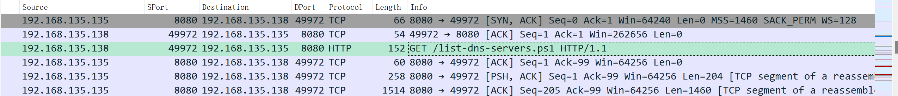

依照這裏的指示：https://hackmd.io/@blackb6a/hkcert-ctf-2023-i-en-a58d115f39feab46#%E6%94%B6%E5%88%B0%E6%94%B6%E5%88%B0--yes-I-know-I-know-Forensic

搜索 `DNS` 相關的數據 `dns && ip.dst == 192.168.135.135 && udp.dstport == 53`

~~好的知道你上學坐巴士了~~ 
看不懂， 在這附近找找看

追蹤 `http` 流 獲得 `list-dns-servers.ps1`

https://gchq.github.io/CyberChef/#recipe=From_Base64('A-Za-z0-9%2B/%3D',true,false)   
文件裏還有一大串 base64 編碼, decode得到 `application.dll`

這好像是個 `.NET` 程序？使用 `ILSpy` 看看？ 
https://github.com/icsharpcode/ILSpy

看起來對了！
繼續分析，發現加密過程如下

- 壓縮為 zip 檔案
- 使用 RC4 加密
- 將結果的 + 替換成 -
- 將結果的 / 替換成 _
- 去除所有 =
- 分段通過 DNS 發送

解密: 使用 cyberchef

將 `igotoschoolbybus.online` (除開 init 那個) 的奇怪的 sub domain 扔進去 (不需要前面的 `0.` 和 `1.`)

cyberchef link:
https://gchq.github.io/CyberChef/#recipe=Find_/_Replace(%7B'option':'Simple%20string','string':'.'%7D,'',true,false,true,false)Find_/_Replace(%7B'option':'Simple%20string','string':'_'%7D,'/',true,false,true,false)Find_/_Replace(%7B'option':'Simple%20string','string':'-'%7D,'%2B',true,false,true,false)RC4(%7B'option':'UTF8','string':'K%232dF!8t@1qZ'%7D,'Base64','Base64')From_Base64('A-Za-z0-9%2B/%3D',true,false)Unzip('',false)&input=RU82eWxGbHNVY183dV9RRDhnQkRwOEw4aUZpR1pHa2hwdENfUXduU2VtX2l2ck8zekZVZ2otbmZpOWhNaGdMLmtoVjJVNnRWekpxNUVXbnoteVhaaEJXRm1LTWFLYU02NXFjbGI3N2tGNU1XeFY2bWRWR0R5ajlCZERKUzZ1Qy40OWg0MWVMT05UNVZfVUhna3NNZE9Sb2wtMmNZZ1dreldqNkg2YWU4dVJ6Z1JNSmpEbVlzczhYQk9la3lpYmUudFFWTU5iMjY2OVp6b1JGa0RaV0l5bEJhSjVDTHA4Y28yZ1lIT2dkSURxajdDSUVXa00

flag: hkcert23{v3ry_5n34ky_w17h_dn53xf1l7r470r_5345623}
